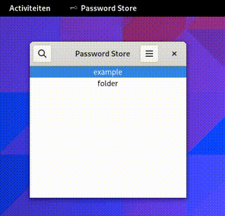

# pypass
A GTK4 frontend for [Password Store](https://www.passwordstore.org/) written in python



## Features
 - Use the result from `pass` by default (Ignores the password directory in the configuration file)
 - Or use the filesystem to show the passwords (Needs the password directory in the configuration file)
 - Optional for both: Hide invalid files (non gpg files)
 - Use `pass-otp` to show or copy the OTP code.
 - Delete selected password when pressing `Delete`
 - Add a new password to the current folder
 - Generates a random password, copy it and uses template fields when creating a new password.
 - Read or copy passwords or other properties (like an username or an (ssh)key) in the view.
 - (Optional) Synchronise your changes with `git`
 - And ofcourse: edit your passwords using `pass`!

## TODO
 - [ ] Integrate Gnome search
 - [ ] Initialize password store if not exists
 - [ ] Add new folders?
 - [ ] Move project to Gnome builder

## Build AppImage
Create the application image by installing a Alpine Linux chroot in `AppDir':

```
sudo ./alpine-chroot-install -d ./AppDir -p gtk4.0 adwaita-icon-theme pass pass-otp python3 py3-gobject3
sudo umount -R ./AppDir/AppDir/{dev,proc,sys}
```

After that you can install pypass in the chroot

```
mkdir -p AppDir/usr/share/icons/hicolor/scalable/apps AppDir/usr/bin AppDir/usr/share/applications
install -Dm755 pypass.py "AppDir/usr/bin/pypass"
install -Dm644 pypass.svg "AppDir/usr/share/icons/hicolor/scalable/apps/com.github.noobping.pypass.svg"
install -Dm644 pypass.desktop "AppDir/usr/share/applications/com.github.noobping.pypass.desktop"
```

And build the AppImage:

```
ARCH=x86_64 ./appimagetool.AppImage --appimage-extract-and-run -v AppDir
```
